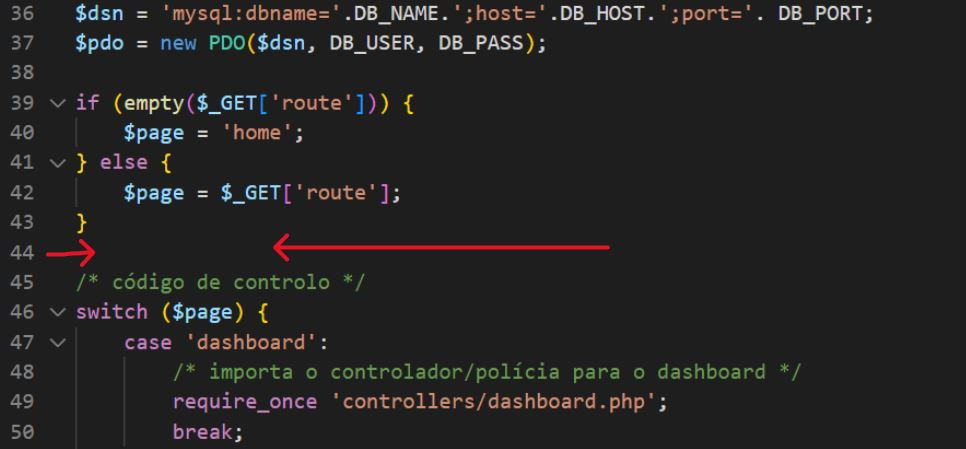
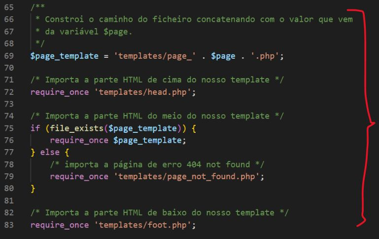
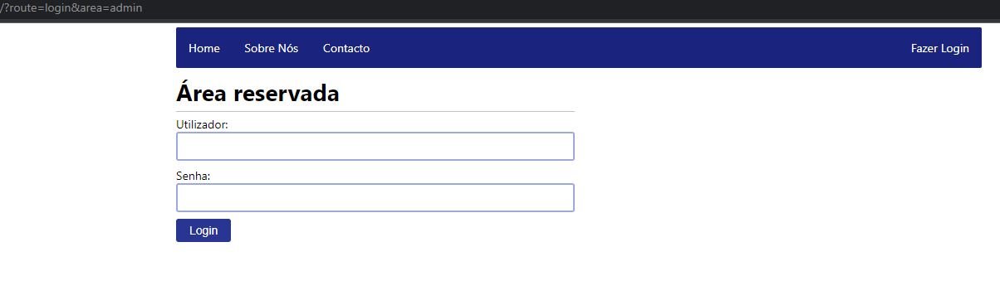
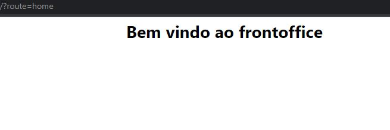

Frontoffice / Backoffice
==============================

# User Story #1
Inicialize o `GIT` na raiz do projeto para se ter o controle das modificações feitas.

# User Story #2
Depois de inicializado, crie uma branch a partir da branch principal (`master`) chamado `develop`. Lembrando que o desenvolvimento deverá ser feito na branch `develop`.

Sempre que possível, faça merge de `develop` para dentro da branch principal `master`.

# User Story #3
Identifique o seguinte trecho de código no ficheiro `index.php` e mude o valor da variável `$page` para `home` no local indicado.


<details>
    <summary>Ver solução</summary>

<span style="color: #ef5350; font-size: 0.9rem">*Digite o código abaixo linha a linha para praticar*</span>

Solução

```php
if (empty($_GET['route'])) {
    $page = 'home';
} else {
    $page = $_GET['route'];
}
```

</details>

---

# User Story #4
Identifique o seguinte trecho de código no ficheiro `index.php`.



Escreva o código abaixo no local indicado

<details>
    <summary>Ver solução</summary>

<span style="color: #ef5350; font-size: 0.9rem">*Digite o código abaixo linha a linha para praticar*</span>

Solução

```php
/**
 * Verificamos se a o valor da chave 'area' NÃO está vazio E se o valor é igual a 'admin'.
 * 
 * Se verdadeiro, então vamos buscar o layout da pasta 'backoffice'
 * Se falso, então vamos buscar o layout da pasta 'frontoffice'
 */
if (!empty($_GET['area']) && $_GET['area'] == 'admin') {
    $layout_folder = 'backoffice';
} else {
    $layout_folder = 'frontoffice';
}
```

</details>

---

# User Story #5
Identifique o seguinte trecho de código no ficheiro `index.php`.



Substitua pelo seguinte código abaixo no local indicado

<details>
    <summary>Ver solução</summary>

<span style="color: #ef5350; font-size: 0.9rem">*Digite o código abaixo linha a linha para praticar*</span>

Solução

```php

/**
 * Constroi o caminho do ficheiro concatenando com o valor que vem 
 * da variável $layout_folder e $page.
 */
$page_template = 'templates/'.$layout_folder.'/page_' . $page . '.php';

/* Importa a parte HTML de cima do nosso template concatenando com o valor que vem  da variável $layout_folder */
require_once 'templates/'.$layout_folder.'/head.php';

/* Importa a parte HTML do meio do nosso template */
if (file_exists($page_template)) {
    require_once $page_template;
} else {
    /* importa a página de erro 404 not found concatenando com o valor que vem da variável $layout_folder */
    require_once 'templates/'.$layout_folder.'/page_not_found.php';
}

/* Importa a parte HTML de baixo do nosso template concatenando com o valor que vem da variável $layout_folder */
require_once 'templates/'.$layout_folder.'/foot.php';
```

</details>

---

# User Story #6
Dentro do diretório `templates` crie as seguintes pastas. 

1. **backoffice**
2. **frontoffice**

---

# User Story #7
Logo a seguir, é preciso **mover** todos os ficheiros que estão dentro do diretório `templates` para a pasta `templates/backoffice`.

Resultado
```
.
└── trabalho-final/
    └── templates/
        ├── backoffice/
        │   ├── head.php
        │   ├── foot.php
        │   ├── page_login.php
        │   ├── page_dashboard.php
        │   └── page_not_found.php
        └── frontoffice
```
</details>

---

# User Story #8
Dentro do diretório `templates/frontoffice`, crie os seguintes ficheiros.

1. **head.php**
2. **foot.php**
3. **page_home.php**
5. **page_not_found.php**

```
.
└── trabalho-final/
    └── templates/
        ├── backoffice/
        │   ├── head.php
        │   ├── foot.php
        │   ├── page_login.php
        │   ├── page_dashboard.php
        │   └── page_not_found.php
        └── frontoffice/
            ├── head.php
            ├── foot.php
            ├── page_home.php
            └── page_not_found.php
```      

Para cada ficheiro, adicione os seguintes blocos de código.
1. **head.php**

<details>
    <summary>Ver solução</summary>

<span style="color: #ef5350; font-size: 0.9rem">*Digite o código abaixo linha a linha para praticar*</span>

Solução

```html
<!DOCTYPE html>
<html lang="en">

<head>
    <meta charset="UTF-8">
    <meta http-equiv="X-UA-Compatible" content="IE=edge">
    <meta name="viewport" content="width=device-width, initial-scale=1.0">
    <title><?php echo PAGE_TITLE; ?></title>
    <link rel="stylesheet" href="public/css/style.css">
</head>

<body>
```
</details>

---

2. **foot.php**

<details>
    <summary>Ver solução</summary>

<span style="color: #ef5350; font-size: 0.9rem">*Digite o código abaixo linha a linha para praticar*</span>

Solução

```html
</body>
</html>
```
</details>

---

3. **page_home.php**

<details>
    <summary>Ver solução</summary>

<span style="color: #ef5350; font-size: 0.9rem">*Digite o código abaixo linha a linha para praticar*</span>

Solução

```html
<div class="page">
    <h1>Bem vindo ao frontoffice</h1>
</div>
```
</details>

---

4. **page_not_found.php**

<details>
    <summary>Ver solução</summary>

<span style="color: #ef5350; font-size: 0.9rem">*Digite o código abaixo linha a linha para praticar*</span>

Solução

```html
<div class="page">
    <h1>404 - Page Not Found</h1>
    <div class="horizontal-line"></div>
    <p>A página solicitada não existe.</p>
</div>
```
</details>

---

# User Story #9
Para testar, basta adicicionar manualmente na **url** as seguintes chaves `querystring`.
1. `?route=login&area=admin` -> Deve aparecer o **backoffice**



2. `?route=home` -> Deve aparecer o **frontoffice**

