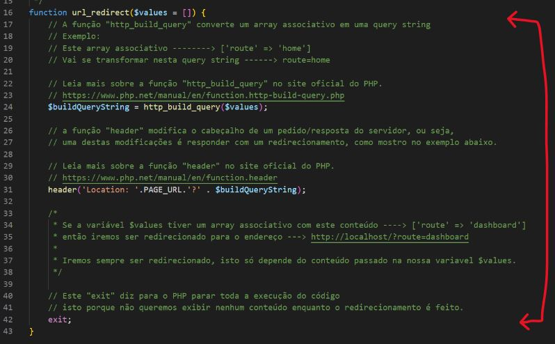
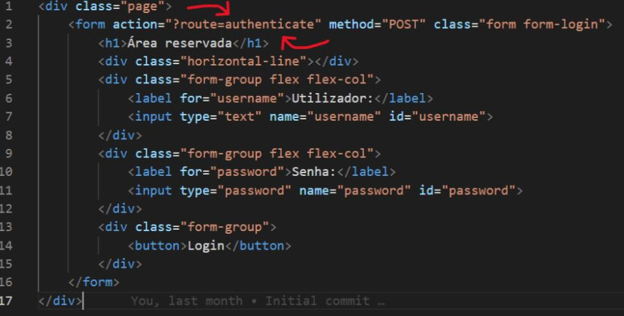
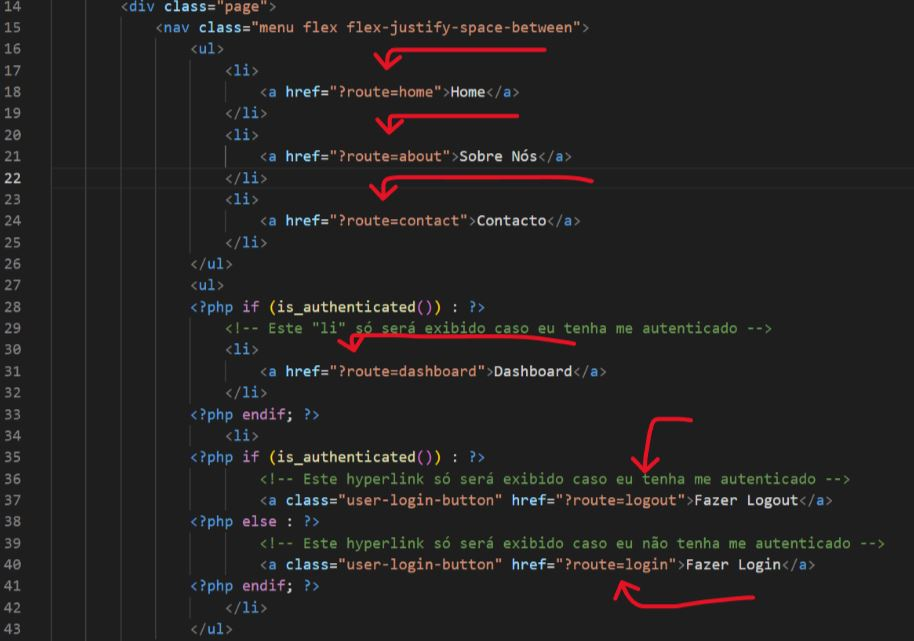

URL Dinâmica
==============================

# User Story #1
Dentro do ficheiro `url.php` que está na pasta `functions`, crie a função abaixo.

<details>
    <summary>Ver solução</summary>

<span style="color: #ef5350; font-size: 0.9rem">*Digite o código abaixo linha a linha para praticar*</span>

Solução

```php
/**
 * O objetivo desta função é gerar uma query string (url) de forma dinâmica.
 * 
 * Exemplo: 
 * Ao passar um array associativo
 * 
 * ['route' => 'login', 'area' => 'admin'], 
 * 
 * vou ter como resultado a seguinte query string (url) --> "?route=login&area=admin"
 * 
 * Ou seja, uma query string (url) foi criada com base nos valores do array 
 * associativo acima.
 * 
 * Isto faz com que não sejamos nós a criar uma query string (url) manualmente
 * e sim o próprio site a fazer este trabalho.
 */
function url_generate($values) {
     // a função 'array_merge' junta os valores existentes na super global $_GET
     // com os valores da variável $values.

    // Leia mais sobre a função "array_merge" no site oficial do PHP.
    // https://www.php.net/manual/en/function.array-merge.php
    $urlQueryString = array_merge($_GET, $values);

    // A função "http_build_query" converte um array associativo em uma query string
    // Exemplo: 
    // Este array associativo --------> ['route' => 'home']
    // Vai se transformar nesta query string ------> route=home
    
    // Leia mais sobre a função "http_build_query" no site oficial do PHP.
    // https://www.php.net/manual/en/function.http-build-query.php
    return '?'.http_build_query($urlQueryString);
}
```

</details>

---

# User Story #2
Identifique o seguinte código no ficheiro `url.php` que está na pasta `functions`.




Substitua pelo seguinte código abaixo

<span style="color: #ef5350; font-size: 0.9rem">Atenção! vejam todas as diferenças.</span>

<details>
    <summary>Ver solução</summary>

<span style="color: #ef5350; font-size: 0.9rem">*Digite o código abaixo linha a linha para praticar*</span>

Solução

```php
function url_redirect($values = []) {
    // a função "header" modifica o cabeçalho de um pedido/resposta do servidor, ou seja,
    // uma destas modificações é responder com um redirecionamento, como mostro no exemplo abaixo.

    // Leia mais sobre a função "header" no site oficial do PHP.
    // https://www.php.net/manual/en/function.header
    header('Location: '. PAGE_URL . url_generate($values));

    /*
     * Se a variável $values tiver um array associativo com este conteúdo ----> ['route' => 'dashboard']
     * então iremos ser redirecionado para o endereço ---> http://localhost/?route=dashboard
     * 
     * Iremos sempre ser redirecionado, isto só depende do conteúdo passado na nossa variavel $values.
     */
    
    // Este "exit" diz para o PHP parar toda a execução do código
    // isto porque não queremos exibir nenhum conteúdo enquanto o redirecionamento é feito.
    exit; 
}
```

</details>

---

# User Story #3
Identifique o seguinte código no ficheiro `page_login.php` que está na pasta `templates/backoffice`.



Substitua pelo seguinte código abaixo

<span style="color: #ef5350; font-size: 0.9rem">Atenção! vejam todas as diferenças.</span>

<details>
    <summary>Ver solução</summary>

<span style="color: #ef5350; font-size: 0.9rem">*Digite o código abaixo linha a linha para praticar*</span>

Solução

```html
<div class="page">
    <form action="<?php echo url_generate(['route' => 'authenticate']); ?>" method="POST" class="form form-login">
        <h1>Área reservada</h1>
        <div class="horizontal-line"></div>
        <div class="form-group flex flex-col">
            <label for="username">Utilizador:</label>
            <input type="text" name="username" id="username">
        </div>
        <div class="form-group flex flex-col">
            <label for="password">Senha:</label>
            <input type="password" name="password" id="password">
        </div>
        <div class="form-group">
            <button>Login</button>
        </div>
    </form>
</div>
```

</details>

---

# User Story #4

Assim como fizeram na `US#3`, identifique o seguinte código abaixo no ficheiro `head.php` que está na pasta `templates/backoffice`.



Substitua pelo código abaixo

<span style="color: #ef5350; font-size: 0.9rem">Atenção! vejam todas as diferenças.</span>

<details>
    <summary>Ver solução</summary>

<span style="color: #ef5350; font-size: 0.9rem">*Digite o código abaixo linha a linha para praticar*</span>

Solução

```html
<!DOCTYPE html>
<html lang="en">

<head>
    <meta charset="UTF-8">
    <meta http-equiv="X-UA-Compatible" content="IE=edge">
    <meta name="viewport" content="width=device-width, initial-scale=1.0">
    <title><?php echo PAGE_TITLE; ?></title>
    <link rel="stylesheet" href="public/css/style.css">
</head>

<body>
    <header>
        <div class="page">
            <nav class="menu flex flex-justify-space-between">
                <ul>
                    <li>
                        <a href="<?php echo url_generate(['route' => 'home']); ?>">Home</a>
                    </li>
                    <li>
                        <a href="<?php echo url_generate(['route' => 'about']); ?>">Sobre Nós</a>
                    </li>
                    <li>
                        <a href="<?php echo url_generate(['route' => 'contact']); ?>">Contacto</a>
                    </li>
                </ul>
                <ul>
                <?php if (is_authenticated()) : ?>
                    <!-- Este "li" só será exibido caso eu tenha me autenticado -->
                    <li>
                        <a href="?route=dashboard">Dashboard</a>
                    </li>
                <?php endif; ?>
                    <li>
                <?php if (is_authenticated()) : ?>
                        <!-- Este hyperlink só será exibido caso eu tenha me autenticado -->
                        <a class="user-login-button" href="<?php echo url_generate(['route' => 'logout']); ?>">Fazer Logout</a>
                <?php else : ?>
                        <!-- Este hyperlink só será exibido caso eu não tenha me autenticado -->
                        <a class="user-login-button" href="<?php echo url_generate(['route' => 'login']); ?>">Fazer Login</a>
                <?php endif; ?>
                    </li>
                </ul>
            </nav>
        </div>
    </header>

    <?php if (get_flash_message()) : ?>
        <div class="page">
            <div class="flash-messages">
                <p><?php echo get_flash_message(); ?></p>
            </div>
        </div>
    <?php endif; ?>
```

</details>

---